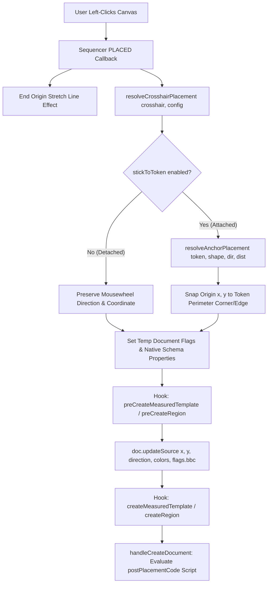

# Bakana's Better Crosshairs — Architecture Guide

This document provides a comprehensive architectural breakdown of **Bakana's Better Crosshairs (`BBC`)** for developers, module authors, and contributors.

---

## Table of Contents
1. [Architectural Principles](#architectural-principles)
2. [Directory Structure](#directory-structure)
3. [Decoupled Adapter Pattern](#decoupled-adapter-pattern)
   - [Foundry Adapter (`BaseFoundryVTTAdapter`)](#foundry-adapter-basefoundryvttadapter)
   - [System Adapters (`BaseSystemAdapter` & Subclasses)](#system-adapters-basesystemadapter--subclasses)
4. [Preview Interception & Lifecycle Hooks](#preview-interception--lifecycle-hooks)
5. [Placement Resolution Pipeline (`resolveCrosshairPlacement`)](#placement-resolution-pipeline-resolvecrosshairplacement)
6. [How to Add a New System Adapter](#how-to-add-a-new-system-adapter)

---

## Architectural Principles

Bakana's Better Crosshairs is designed around three foundational principles:
1. **Strict Foundry ApplicationV2 Compliance**: Zero legacy ApplicationV1 code. Configuration apps and prompt dialogs inherit directly from `foundry.applications.api.HandlebarsApplicationMixin(ApplicationV2)`.
2. **PreCreate Hook Data Transformation**: Never manually call `canvas.scene.createEmbeddedDocuments("MeasuredTemplate", ...)` from targeting callbacks. Instead, modify the pending document data (`doc.updateSource(updateData)`) inside `preCreateMeasuredTemplate` so core and third-party workflow hooks (`Midi-QOL`, Item Workflows) execute uninterrupted.
3. **Decoupled System & Canvas Context**: The Foundry canvas adapter (`BaseFoundryVTTAdapter`) handles generic Foundry placeables, while system rules (`DnD5e 4.x Activities`, flags, sorting) are encapsulated strictly in system adapters (`Dnd5eSystemAdapter`).

---

## Directory Structure

```text
src/
├── adapter/
│   ├── foundry/
│   │   ├── base-foundryvtt-adapter.js     # Shared abstract Foundry context & lookup pipeline
│   │   ├── foundryvtt-v13-adapter.js      # V12/V13 MeasuredTemplate adapter (pixel sizing)
│   │   ├── foundryvtt-v14-adapter.js      # V14+ Region adapter (grid units & feet-to-pixel scaling)
│   │   └── index.js                       # Auto-selects active Foundry version adapter
│   └── system/
│       ├── base-system-adapter.js         # Generic system fallback adapter
│       ├── dnd5e-adapter.js               # D&D 5e v3/v4 activity & flag extraction
│       ├── pf2e-adapter.js                # PF2e action/strike & deferred placement adapter
│       └── index.js                       # Auto-selects active system adapter
├── autorec/
│   ├── BaseCrosshairMenuApplication.js    # Abstract ApplicationV2 base menu component
│   ├── CrosshairConfiguration.js          # Canonical crosshair configuration schema & model
│   ├── autorecManager.js                  # Stores and retrieves prioritized Autorec rules
│   ├── autorecMenu.js                     # ApplicationV2 UI for Autorec rules
│   └── itemConfigMenu.js                  # ApplicationV2 UI for per-item configuration
├── crosshair/
│   ├── base.js                            # BaseCrosshairShape template method class
│   ├── circle.js                          # Circle crosshair Sequencer builder
│   ├── cone.js                            # Cone crosshair Sequencer builder
│   ├── index.js                           # Public crosshair shape factory & barrel exports
│   ├── ray.js                             # Ray crosshair Sequencer builder
│   ├── square.js                          # Square/Rect crosshair Sequencer builder
│   └── util.js                            # Placement resolvers & precision mousewheel hooks
├── lib/
│   ├── compat.js                          # Safe Foundry version compatibility wrappers
│   ├── constants.js                       # Shared module constants
│   ├── dependency.js                      # Module dependency validation engine
│   ├── filemanager.js                     # Sequencer database path/asset resolution
│   ├── logger.js                          # Structured logging system
│   ├── notifier.js                        # UI notification batcher
│   └── utils.js                           # Localization and version helper utilities
└── module.js                              # Main entrypoint & hook registration
```

---

## Decoupled Adapter Pattern

### Foundry Adapters (`BaseFoundryVTTAdapter` & Version Subclasses)
Located in [`src/adapter/foundry/`](../src/adapter/foundry/), Foundry adapters isolate tabletop version differences and host preview interceptors:
- **`BaseFoundryVTTAdapter`**: Implements shared lookup matching (`matchAutorecEntry`), candidate ordering, live default preview hiding (`hidePreview`), and core placement lifecycle handlers (`handleDrawPreview`, `handlePreCreate`, `handleCreateDocument`).
- **`FoundryVTTV13Adapter`**: Handles V13 `MeasuredTemplate` placement hooks (`drawMeasuredTemplate` → `preCreateMeasuredTemplate` → `createMeasuredTemplate`) with legacy pixel sizing (`getTemplatePixelFactor` returning `{ factor: 1, gridUnits: false }`).
- **`FoundryVTTV14Adapter`**: Handles V14+ `Region` placement hooks (`drawMeasuredTemplate` → `preCreateRegion` → `createRegion`). Converts game feet (`distance`, `width`) to canvas pixels (`* pxPerFoot`) inside `_formatRegionShapeUpdate` and returns `{ factor: 1 / gridSize, gridUnits: true }` so Sequencer effects render accurate grid unit dimensions.

### Multi-Activity Priority Matching (`matchAutorecEntry` & `getEntriesForItem`)
When a template or region for an item (`e.g. Longbow`) is drawn, `matchAutorecEntry` evaluates crosshair overrides according to a strict 4-tier preference hierarchy:

1. **`CUSTOM CONFIG` (Item Flags Override)**: If `item.flags["bakana-better-crosshairs"].customConfig` exists and is active (`enabled !== false`), it immediately takes precedence over all Autorec rules.
2. **`AUTOREC MATCH` (Candidate Workflows)**: If no custom item override is active, `autorecManager.getEntriesForItem(itemName)` is queried:
   - **Activity-Specific Workflows (`Longbow > Rapid Fire`, `Longbow > Line Fire`)**: Sorted to the front (`aHasAct && !bHasAct`).
   - **General Item Fallback Workflows (`Longbow > <no activity named>`)**: Sorted to the back.
   - **Stable Tiebreaking**: Evaluated front-to-back (`first registered matching rule wins`).
3. **`AUTOREC DEFAULT` (Global Fallback)**: If no matching workflow exists, the `DEFAULT` entry in `autorecManager` applies if enabled.
4. **`FOUNDRY DEFAULT`**: Otherwise `matchAutorecEntry` returns `null` and standard tabletop placement applies.

### Programmatic Customization (`bbc.manager.customize` & `bbc.manager.getDefaultConfig`)
Modules and systems without native support can programmatically interact with item crosshairs:
- `bbc.manager.getDefaultConfig()`: Returns a fresh reference copy (`{ ...DEFAULT_AUTOREC_ENTRY }`) of the default crosshair schema.
- `bbc.manager.customize(item, config)`: Programmatically sets or clears (`config === undefined`) the `customConfig` flag on an item owned by the calling user.

### System Adapters (`BaseSystemAdapter` & Subclasses)

Located in [`src/adapter/system/`](../src/adapter/system/), system adapters determine whether a candidate Autorec entry matches the calling context:
- **`BaseSystemAdapter`**: Checks generic `itemName` / `itemId` equality against registered rules.
- **`Dnd5eSystemAdapter`**: Resolves D&D 5e origin UUIDs (`flags.dnd5e.origin`), extracts v4 Activity objects (`item.system.activities`), and matches both `activityId` and `activityName` case-insensitively.
- **`Pf2eSystemAdapter`**: Resolves Pathfinder 2e actions/strikes, handles single-click programmatic template creation deferrals, and extracts PF2e item context cleanly.

---

## Preview Interception & Lifecycle Hooks

When a player or workflow initiates template placement (`MeasuredTemplate.prototype.drawPreview`), the following sequence occurs:

1. **Draw Interception**: `handleDrawPreview(placeable)` (`BaseFoundryVTTAdapter` / `crosshairAdapter`) inspects the placeable document.
2. **Rule Lookup**: `autorecManager.getEntryForDocument(placeable.document)` queries `crosshairAdapter.matchAutorecEntry(doc, registeredHandlers)`.
3. **Hide Default Visuals**: If a match is found, `crosshairAdapter.hidePreview(placeable)` hides Foundry's default template mesh.
4. **Spawn Crosshair**: The corresponding shape builder (`Circle`, `Cone`, `Ray`, `Square`) constructs a dynamic `new Sequence().crosshair(...)` reticle and attaches custom callbacks (`SHOW`, `PLACED`, `CANCEL`).

---

## Placement Resolution Pipeline (`resolveCrosshairPlacement`)

When a user left-clicks on the canvas to place a crosshair (`Sequencer.Crosshair.CALLBACKS.PLACED`):



---

## Document Flags & Schema Contracts (`extractPlacedStylingFlags`)

When coordinates and placement data are written to a document (`applyDocumentPlacement`), properties are divided between **Native Document Schema Fields** and **Document Flags (`doc.flags.bbc`)**:

### Native Document Schema Fields (Direct Database Persistence)
Foundry VTT `MeasuredTemplate` documents natively store color and dimension fields in their schema data. When `applyDocumentPlacement` updates the document source, top-level schema fields are updated directly:
- `fillColor`, `borderColor`, `fillAlpha`, `borderAlpha` (on `MeasuredTemplate` documents)
- `color`, `alpha` (on `Region` documents)

Because these are top-level properties defined on Foundry document models, Foundry saves them natively to scene collection data in the database.

### Document Flags (`doc.flags.bbc`) (Metadata & Hook Bridge)
In addition to native properties, `extractPlacedStylingFlags` injects a metadata dictionary onto `doc.flags.bbc`:

```javascript
flags: {
    bbc: {
        itemName: config.itemName ?? "",
        activityName: config.activityName ?? "",
        activityId: config.activityId ?? "",
        postPlacementCode: config.postPlacementCode ?? "",
        placedFillColor: config.placedFillColor,
        placedFillAlpha: config.placedFillAlpha,
        placedBorderColor: config.placedBorderColor,
        placedBorderAlpha: config.placedBorderAlpha
    }
}
```

#### Why are Document Flags Necessary?
1. **Asynchronous Post-Placement Script Execution ([`handleCreateDocument`](file:///usr/local/google/home/aljames/github/bakana-better-crosshairs/src/adapter/foundry/base-foundryvtt-adapter.js#L1070-L1108))**: When Foundry emits `createMeasuredTemplate` or `createRegion`, the caller's transient memory scope is lost. Placing `postPlacementCode` in `doc.flags.bbc` allows the creation handler to extract and execute custom macros reliably without global variable leaks.
   - **Exposed Script Context**: `(doc, token, actor, item, scope, config, canvas, game)` where `doc` is the created template/region and `token` is the source caster token.
2. **Dual Fill/Border Support on V14 Regions**: Foundry V14 Region objects only provide a single unified `color` property. Storing distinct `placedFillColor` and `placedBorderColor` in `flags.bbc` preserves split inner/outer color data.
3. **PIXI Render Interception ([`handleMeasuredTemplateRefresh`](file:///usr/local/google/home/aljames/github/bakana-better-crosshairs/src/adapter/foundry/base-foundryvtt-adapter.js#L463-L525))**: When system templates override PIXI rendering instructions, `handleMeasuredTemplateRefresh` reads `doc.flags.bbc` to guarantee BBC visual color profiles override default system graphic drawing.

---

## How to Add a New System Adapter

To add support for a new tabletop game system (e.g., `PF2e`):

1. Create `src/adapter/system/pf2e-adapter.js` subclassing `BaseSystemAdapter`.
2. Override `extractCallingContext(document, baseContext)` to parse PF2e action/strike UUIDs or flags.
3. Override `shouldReplace(context, entry)` to implement any special rule filtering.
4. Register the adapter in `src/adapter/system/index.js`:

```javascript
import { Pf2eSystemAdapter } from "./pf2e-adapter.js";

export function getSystemAdapter() {
    if (game.system.id === "pf2e") return new Pf2eSystemAdapter();
    return new BaseSystemAdapter();
}
```
