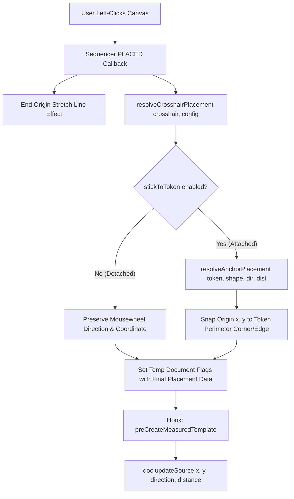

# Bakana's Better Crosshairs — Architecture Guide

This document provides a comprehensive architectural breakdown of **Bakana's Better Crosshairs (`BBC`)** for developers, module authors, and contributors.

---

## Table of Contents
1. [Architectural Principles](#architectural-principles)
2. [Directory Structure](#directory-structure)
3. [Decoupled Adapter Pattern](#decoupled-adapter-pattern)
   - [Foundry Adapter (`BaseFoundryVTTAdapter`)](#foundry-adapter-basefoundryvttadapter)
   - [System Adapters (`BaseSystemAdapter` & Subclasses)](#system-adapters-basesystemadapter--subclasses)
4. [Preview Interception & Lifecycle Hooks](#preview-interception--lifecycle-hooks)
5. [Placement Resolution Pipeline (`resolveCrosshairPlacement`)](#placement-resolution-pipeline-resolvecrosshairplacement)
6. [How to Add a New System Adapter](#how-to-add-a-new-system-adapter)

---

## Architectural Principles

Bakana's Better Crosshairs is designed around three foundational principles:
1. **Strict Foundry ApplicationV2 Compliance**: Zero legacy ApplicationV1 code. Configuration apps and prompt dialogs inherit directly from `foundry.applications.api.HandlebarsApplicationMixin(ApplicationV2)`.
2. **PreCreate Hook Data Transformation**: Never manually call `canvas.scene.createEmbeddedDocuments("MeasuredTemplate", ...)` from targeting callbacks. Instead, modify the pending document data (`doc.updateSource(updateData)`) inside `preCreateMeasuredTemplate` so core and third-party workflow hooks (`Midi-QOL`, Item Workflows) execute uninterrupted.
3. **Decoupled System & Canvas Context**: The Foundry canvas adapter (`BaseFoundryVTTAdapter`) handles generic Foundry placeables, while system rules (`DnD5e 4.x Activities`, flags, sorting) are encapsulated strictly in system adapters (`Dnd5eSystemAdapter`).

---

## Directory Structure

```text
src/
├── adapter/
│   ├── foundry/
│   │   ├── base-foundryvtt-adapter.js     # Extracts core Foundry context and hides live default previews
│   │   └── index.js
│   └── system/
│       ├── base-system-adapter.js         # Generic system fallback adapter
│       ├── dnd5e-adapter.js               # D&D 5e v3/v4 activity & flag extraction
│       └── index.js                       # Auto-selects active system adapter
├── autorec/
│   ├── autorecManager.js                  # Stores and retrieves matched Autorec rules
│   └── autorecMenu.js                     # ApplicationV2 UI for Autorec rules
├── crosshair/
│   ├── circle.js                          # Circle crosshair Sequencer builder
│   ├── cone.js                            # Cone crosshair Sequencer builder
│   ├── ray.js                             # Ray crosshair Sequencer builder
│   ├── square.js                          # Square/Rect crosshair Sequencer builder
│   └── util.js                            # Placement resolvers & precision mousewheel hooks
├── lib/
│   ├── compat.js                          # Safe Foundry version compatibility wrappers
│   ├── filemanager.js                     # Sequencer database path/asset resolution
│   ├── logger.js                          # Structured logging system
│   └── templates.js                       # MeasuredTemplate preview interceptors
└── index.js                               # Main entrypoint & hook registration
```

---

## Decoupled Adapter Pattern

### Foundry Adapter (`BaseFoundryVTTAdapter`)
Located in [`src/adapter/foundry/base-foundryvtt-adapter.js`](../src/adapter/foundry/base-foundryvtt-adapter.js), the Foundry adapter is responsible for:
- Extracting base document properties (`document.item`, `document.activity`) without assuming a specific tabletop game system.
- Delegating system-specific flag resolution to `systemAdapter.extractCallingContext`.
- Suppressing default Foundry visual previews (`placeable.visible = false; placeable.renderable = false;`) when a Sequencer crosshair takes over.

### System Adapters (`BaseSystemAdapter` & Subclasses)
Located in [`src/adapter/system/`](../src/adapter/system/), system adapters determine whether a pending placeable matches a registered Autorec entry:
- **`BaseSystemAdapter`**: Checks generic `itemName` / `itemId` equality against registered rules.
- **`Dnd5eSystemAdapter`**: Resolves D&D 5e origin UUIDs (`flags.dnd5e.origin`), extracts v4 Activity objects (`item.system.activities`), and matches both `activityId` and `activityName` case-insensitively.

---

## Preview Interception & Lifecycle Hooks

When a player or workflow initiates template placement (`MeasuredTemplate.prototype.drawPreview`), the following sequence occurs:

1. **Draw Interception**: `handleDrawPreview(placeable)` (`src/lib/templates.js`) inspects the placeable document.
2. **Rule Lookup**: `autorecManager.getRegisteredEntry(placeable)` queries `crosshairAdapter.matchAutorecEntry(target, registeredHandlers)`.
3. **Hide Default Visuals**: If a match is found, `crosshairAdapter.hidePreview(placeable)` hides Foundry's default template mesh.
4. **Spawn Crosshair**: The corresponding shape builder (`Circle`, `Cone`, `Ray`, `Square`) constructs a dynamic `new Sequence().crosshair(...)` reticle and attaches custom callbacks (`SHOW`, `PLACED`, `CANCEL`).

---

## Placement Resolution Pipeline (`resolveCrosshairPlacement`)

When a user left-clicks on the canvas to place a crosshair (`Sequencer.Crosshair.CALLBACKS.PLACED`):



---

## How to Add a New System Adapter

To add support for a new tabletop game system (e.g., `PF2e`):

1. Create `src/adapter/system/pf2e-adapter.js` subclassing `BaseSystemAdapter`.
2. Override `extractCallingContext(document, baseContext)` to parse PF2e action/strike UUIDs or flags.
3. Override `shouldReplace(context, entry)` to implement any special rule filtering.
4. Register the adapter in `src/adapter/system/index.js`:

```javascript
import { Pf2eSystemAdapter } from "./pf2e-adapter.js";

export function getSystemAdapter() {
    if (game.system.id === "pf2e") return new Pf2eSystemAdapter();
    return new BaseSystemAdapter();
}
```
