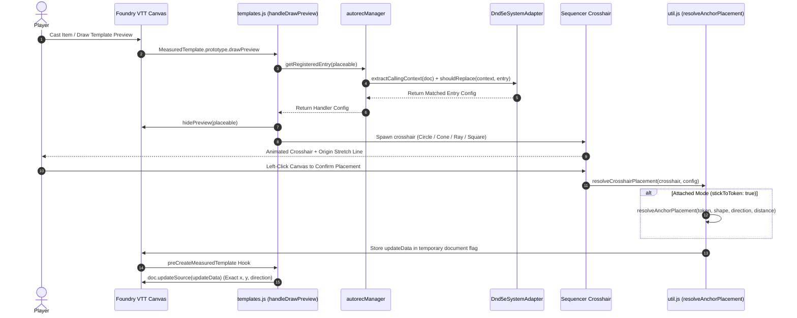

# Bakana's Better Crosshairs — Function Call Tree & Developer API

This document maps the execution flow, function call hierarchy, and key API signatures for **Bakana's Better Crosshairs (`BBC`)**.

---

## Table of Contents
1. [High-Level Sequence Trace](#high-level-sequence-trace)
2. [Module Function Tree](#module-function-tree)
3. [Developer API Reference](#developer-api-reference)
   - [Placement & Coordinate Utilities (`src/crosshair/util.js`)](#placement--coordinate-utilities-srccrosshairutiljs)
   - [Adapter Core Methods (`src/adapter/`)](#adapter-core-methods-srcadapter)

---

## High-Level Sequence Trace



---

## Module Function Tree

```text
src/index.js
├── Hooks.once("init")
│   ├── registerSettings()
│   ├── registerKeybindings()
│   └── autorecManager.initialize()
└── Hooks.on("preCreateMeasuredTemplate", handlePreCreate)

src/lib/templates.js
├── handleDrawPreview(placeable)
│   ├── autorecManager.getRegisteredEntry(placeable)
│   ├── crosshairAdapter.hidePreview(placeable)
│   └── crosshairModule.create(token, handlerConfig)

src/autorec/autorecManager.js
├── getRegisteredEntry(target)
│   └── crosshairAdapter.matchAutorecEntry(target, registeredHandlers)

src/adapter/foundry/base-foundryvtt-adapter.js
├── extractCallingContext(target)
│   └── systemAdapter.extractCallingContext(document, baseContext)
└── matchAutorecEntry(doc, entries)
    └── systemAdapter.shouldReplace(context, entry)

src/adapter/system/dnd5e-adapter.js
├── extractCallingContext(document, baseContext)
│   ├── Resolve flags.dnd5e.origin
│   └── Resolve item.system.activities.get(activityId)
└── shouldReplace(context, entry)
    ├── Match Item Name or Item UUID
    └── Match Activity Name or Activity UUID (case-insensitive)

src/crosshair/util.js
├── attachWheelRotation(crosshair, config)
│   └── Rotate primary shape graphic & preserveExactDirection
├── getCrosshairOriginTarget(crosshair)
│   └── Proxy object returning exact origin (crosshair.x, crosshair.y)
├── resolveAnchorPlacement(token, shape, direction, distance)
│   └── Calculate exact perimeter edge/corner coordinate for attached Cone/Ray/Square
└── resolveCrosshairPlacement(crosshair, config, ...args)
    └── Apply final coordinates and trigger Foundry document creation
```

---

## Developer API Reference

### Placement & Coordinate Utilities (`src/crosshair/util.js`)

#### `getCrosshairOriginTarget(crosshair)`
Returns a dynamic proxy object for Sequencer `.stretchTo(target)` so origin stretch lines point continuously from a token to the crosshair's starting vertex (`crosshair.x, crosshair.y`).
- **Arguments**:
  - `crosshair` (*CrosshairsPlaceable*): The Sequencer crosshair instance.
- **Returns**: `{ x: number, y: number, center: { x: number, y: number } }` proxy.

#### `resolveAnchorPlacement(token, shape, direction, distance)`
Calculates the exact token edge or corner coordinate (`x, y`) where an attached template should originate so it aligns 1:1 with a locked Sequencer graphic.
- **Arguments**:
  - `token` (*Token*): The casting Foundry token placeable.
  - `shape` (*string*): `"cone"`, `"ray"`, `"square"`, or `"circle"`.
  - `direction` (*number*): Direction angle in degrees.
  - `distance` (*number*): Template distance/length in grid units.
- **Returns**: `{ x: number, y: number }` world pixel coordinates.

#### `attachWheelRotation(crosshair, config)`
Binds a global canvas mousewheel listener (`Shift+Scroll` / `Ctrl+Scroll`) to rotate detached crosshairs cleanly without mutating origin stretch line effects.

---

### Adapter Core Methods (`src/adapter/`)

#### `Dnd5eSystemAdapter.prototype.shouldReplace(context, entry)`
Evaluates whether an item/activity matches an Autorec configuration entry.
- **Arguments**:
  - `context` (*Object*): Extracted calling item and activity context.
  - `entry` (*Object*): Registered Autorec rule entry.
- **Returns**: `boolean` — `true` if item and optional activity filters match.
